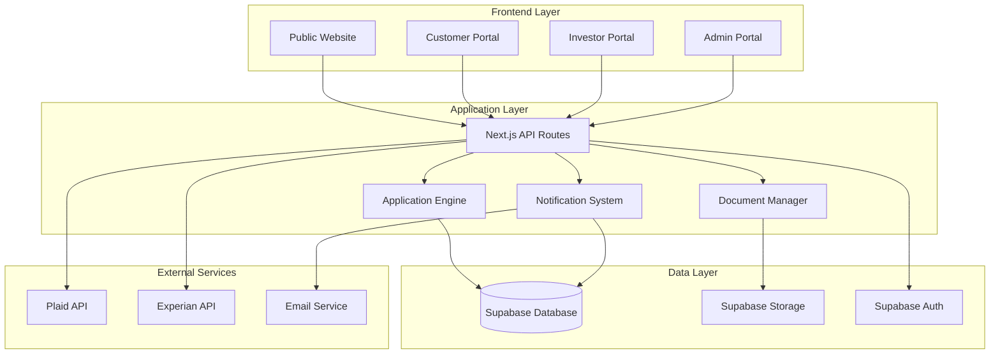

# Design Document: Commercial Lending Platform

## Overview

The commercial lending platform is a multi-tenant SaaS application that connects borrowers with investors through a transparent, easy-to-use interface. The platform consists of four main portals (public website, customer portal, investor portal, and admin portal) built on a modern tech stack using Next.js, Supabase, and Vercel.

The architecture prioritizes ease of use and transparency through:
- Step-by-step application processes that adapt based on user responses
- Real-time status tracking and notifications
- Comprehensive dashboards for all user types
- Seamless integration with third-party verification services

## Architecture

### High-Level Architecture



### Multi-Tenancy Strategy

The platform implements multi-tenancy using Supabase's Row-Level Security (RLS) policies:

- **Tenant Isolation**: Each organization (borrower company, investor group) is a separate tenant
- **User Association**: Users are linked to tenants via `app_metadata.tenant_id` in Supabase Auth
- **Data Isolation**: All tables include `tenant_id` columns with RLS policies enforcing access control
- **Shared Infrastructure**: Single database instance serves all tenants with policy-based isolation

### Technology Stack

- **Frontend**: Next.js 14 with App Router, TypeScript, Tailwind CSS
- **Backend**: Next.js API Routes, Supabase Edge Functions
- **Database**: Supabase (PostgreSQL) with Row-Level Security
- **Authentication**: Supabase Auth with role-based access control
- **Storage**: Supabase Storage for document management
- **Deployment**: Vercel with automatic deployments from GitHub
- **External APIs**: Plaid (banking data), Experian (credit verification)

## Components and Interfaces

### 1. Public Website Component

**Purpose**: Lead generation and initial user engagement

**Key Features**:
- High-converting landing page with clear value propositions
- Loan product information and company details
- FAQ section addressing common concerns
- Lead capture forms with progressive disclosure
- Call-to-action buttons directing to application process

**Interface**: Static pages with embedded lead capture forms

### 2. Application Engine

**Purpose**: Manages the step-by-step loan application process

**Key Features**:
- Dynamic form generation based on previous responses
- Conditional logic for required information
- Progress tracking and auto-save functionality
- Document upload integration
- Data validation and verification triggers

**Interface**:
```typescript
interface ApplicationEngine {
  startApplication(leadData: LeadData): ApplicationSession
  getNextStep(sessionId: string, responses: FormResponses): ApplicationStep
  saveProgress(sessionId: string, stepData: StepData): void
  submitApplication(sessionId: string): Application
}

interface ApplicationStep {
  stepId: string
  title: string
  fields: FormField[]
  isRequired: boolean
  nextStepId?: string
}
```

### 3. Portal System

**Purpose**: Provides role-based interfaces for different user types

#### Customer Portal
- Application status tracking
- Loan management dashboard
- Document upload interface
- Payment history and real-time payoff amounts
- New loan application initiation

#### Investor Portal
- Available loan pool display
- Investment opportunity details
- Portfolio performance dashboard
- Funding interface (full or partial)
- Historical investment tracking

#### Admin Portal
- Operational dashboards and reporting
- Loan approval workflow management
- User and tenant management
- Application process analytics
- System configuration tools

**Interface**:
```typescript
interface PortalSystem {
  getPortalData(userId: string, portalType: PortalType): PortalData
  updatePortalPreferences(userId: string, preferences: UserPreferences): void
  generateReport(reportType: ReportType, filters: ReportFilters): Report
}
```

### 4. Notification System

**Purpose**: Manages alerts and updates across all portals

**Key Features**:
- Real-time in-app notifications
- Email notification triggers
- Status change alerts
- Investment opportunity notifications
- Application progress updates

**Interface**:
```typescript
interface NotificationSystem {
  sendNotification(userId: string, notification: Notification): void
  getNotifications(userId: string, filters?: NotificationFilters): Notification[]
  markAsRead(notificationId: string): void
  subscribeToUpdates(userId: string, eventTypes: EventType[]): void
}
```

### 5. Document Manager

**Purpose**: Handles document uploads, storage, and verification

**Key Features**:
- Secure document upload with file type validation
- Document categorization and tagging
- Integration with verification services
- Version control and audit trails
- Secure access controls

**Interface**:
```typescript
interface DocumentManager {
  uploadDocument(file: File, metadata: DocumentMetadata): Document
  getDocuments(applicationId: string): Document[]
  verifyDocument(documentId: string): VerificationResult
  deleteDocument(documentId: string): void
}
```

## Data Models

### Core Entities

```typescript
// Tenant Management
interface Tenant {
  id: string
  name: string
  type: 'borrower' | 'investor' | 'admin'
  created_at: Date
  updated_at: Date
}

// User Management
interface User {
  id: string
  email: string
  tenant_id: string
  role: 'borrower' | 'investor' | 'admin'
  profile: UserProfile
  created_at: Date
}

// Loan Application
interface Application {
  id: string
  tenant_id: string
  applicant_id: string
  status: ApplicationStatus
  loan_amount: number
  loan_purpose: string
  business_info: BusinessInfo
  financial_info: FinancialInfo
  documents: Document[]
  created_at: Date
  updated_at: Date
}

// Loan Management
interface Loan {
  id: string
  application_id: string
  tenant_id: string
  principal_amount: number
  interest_rate: number
  term_months: number
  status: LoanStatus
  funding_status: FundingStatus
  created_at: Date
}

// Investment Tracking
interface Investment {
  id: string
  loan_id: string
  investor_id: string
  tenant_id: string
  amount: number
  percentage: number
  status: InvestmentStatus
  returns: number
  created_at: Date
}

// Document Management
interface Document {
  id: string
  application_id: string
  tenant_id: string
  file_name: string
  file_type: string
  file_size: number
  storage_path: string
  verification_status: VerificationStatus
  uploaded_at: Date
}
```

### Database Schema

```sql
-- Tenants table
CREATE TABLE tenants (
  id UUID PRIMARY KEY DEFAULT gen_random_uuid(),
  name VARCHAR(255) NOT NULL,
  type VARCHAR(50) NOT NULL CHECK (type IN ('borrower', 'investor', 'admin')),
  created_at TIMESTAMP WITH TIME ZONE DEFAULT NOW(),
  updated_at TIMESTAMP WITH TIME ZONE DEFAULT NOW()
);

-- Applications table
CREATE TABLE applications (
  id UUID PRIMARY KEY DEFAULT gen_random_uuid(),
  tenant_id UUID REFERENCES tenants(id),
  applicant_id UUID REFERENCES auth.users(id),
  status VARCHAR(50) NOT NULL DEFAULT 'draft',
  loan_amount DECIMAL(12,2),
  loan_purpose TEXT,
  business_info JSONB,
  financial_info JSONB,
  created_at TIMESTAMP WITH TIME ZONE DEFAULT NOW(),
  updated_at TIMESTAMP WITH TIME ZONE DEFAULT NOW()
);

-- Loans table
CREATE TABLE loans (
  id UUID PRIMARY KEY DEFAULT gen_random_uuid(),
  application_id UUID REFERENCES applications(id),
  tenant_id UUID REFERENCES tenants(id),
  principal_amount DECIMAL(12,2) NOT NULL,
  interest_rate DECIMAL(5,4) NOT NULL,
  term_months INTEGER NOT NULL,
  status VARCHAR(50) NOT NULL DEFAULT 'pending',
  funding_status VARCHAR(50) NOT NULL DEFAULT 'unfunded',
  created_at TIMESTAMP WITH TIME ZONE DEFAULT NOW(),
  updated_at TIMESTAMP WITH TIME ZONE DEFAULT NOW()
);

-- Investments table
CREATE TABLE investments (
  id UUID PRIMARY KEY DEFAULT gen_random_uuid(),
  loan_id UUID REFERENCES loans(id),
  investor_id UUID REFERENCES auth.users(id),
  tenant_id UUID REFERENCES tenants(id),
  amount DECIMAL(12,2) NOT NULL,
  percentage DECIMAL(5,4) NOT NULL,
  status VARCHAR(50) NOT NULL DEFAULT 'pending',
  returns DECIMAL(12,2) DEFAULT 0,
  created_at TIMESTAMP WITH TIME ZONE DEFAULT NOW()
);

-- Documents table
CREATE TABLE documents (
  id UUID PRIMARY KEY DEFAULT gen_random_uuid(),
  application_id UUID REFERENCES applications(id),
  tenant_id UUID REFERENCES tenants(id),
  file_name VARCHAR(255) NOT NULL,
  file_type VARCHAR(100) NOT NULL,
  file_size INTEGER NOT NULL,
  storage_path TEXT NOT NULL,
  verification_status VARCHAR(50) DEFAULT 'pending',
  uploaded_at TIMESTAMP WITH TIME ZONE DEFAULT NOW()
);

-- RLS Policies
ALTER TABLE applications ENABLE ROW LEVEL SECURITY;
ALTER TABLE loans ENABLE ROW LEVEL SECURITY;
ALTER TABLE investments ENABLE ROW LEVEL SECURITY;
ALTER TABLE documents ENABLE ROW LEVEL SECURITY;

-- Helper function for tenant access
CREATE OR REPLACE FUNCTION auth.tenant_id() 
RETURNS TEXT
LANGUAGE SQL STABLE
AS $$
  SELECT 
    NULLIF(
      ((current_setting('request.jwt.claims')::jsonb ->> 'app_metadata')::jsonb ->> 'tenant_id'),
      ''
    )::text
$$;

-- Example RLS policy
CREATE POLICY "Users can only access their tenant's applications" ON applications
  FOR ALL USING (auth.tenant_id() = tenant_id::text);
```

## Correctness Properties

*A property is a characteristic or behavior that should hold true across all valid executions of a system—essentially, a formal statement about what the system should do. Properties serve as the bridge between human-readable specifications and machine-verifiable correctness guarantees.*

### Property 1: Lead Capture Before Application
*For any* user attempting to start a loan application, the system should capture lead information before allowing access to the full application process.
**Validates: Requirements 1.4**

### Property 2: Dynamic Application Flow
*For any* loan application session and any set of user responses, the Application Engine should determine the next step based on the current responses, including or excluding steps dynamically based on the information provided.
**Validates: Requirements 2.1, 2.2, 2.3, 2.4**

### Property 3: Application Progress Persistence
*For any* incomplete loan application, the system should save progress automatically and allow the borrower to resume from where they left off.
**Validates: Requirements 2.6**

### Property 4: Portal Account Creation
*For any* borrower starting a loan application, the Portal System should automatically create a customer portal account linked to that borrower.
**Validates: Requirements 3.1**

### Property 5: Real-time Payoff Calculation
*For any* active loan, the Portal System should provide accurate real-time payoff amounts that reflect current principal, interest, and payment status.
**Validates: Requirements 3.3**

### Property 6: Comprehensive Loan Display
*For any* borrower accessing their portal, the system should display all current and past loans associated with their account.
**Validates: Requirements 3.6**

### Property 7: Investment Funding Flexibility
*For any* available loan in the investor portal, the system should allow investors to fund either 100% of the loan amount or participate as partial funders with accurate percentage calculations.
**Validates: Requirements 4.2**

### Property 8: Investment Performance Tracking
*For any* investor with active investments, the portal should accurately track and display historical performance data including amounts invested and returns generated.
**Validates: Requirements 4.6**

### Property 9: Status Change Notifications
*For any* loan status change or new investment opportunity, the Notification System should generate appropriate alerts to the relevant users (borrowers for their loans, investors for opportunities).
**Validates: Requirements 3.4, 4.4, 4.5**

### Property 10: Application Metrics Tracking
*For any* loan application process, the system should accurately track completion rates, abandonment rates, and other process metrics for administrative reporting.
**Validates: Requirements 5.3**

### Property 11: Admin Intervention Capability
*For any* loan in the approval process, administrators should be able to access and modify the approval workflow when intervention is needed.
**Validates: Requirements 5.5**

### Property 12: Verification Workflow
*For any* customer information requiring verification, the system should attempt automatic verification through third-party APIs, process verified information automatically, and flag unverifiable information for human review.
**Validates: Requirements 6.1, 6.2, 6.3**

### Property 13: Verification Audit Trail
*For any* verification attempt, the system should log the attempt, the method used, the result, and timestamp for audit purposes.
**Validates: Requirements 6.5**

### Property 14: Role-based Portal Routing
*For any* user logging into the system, they should be directed to the appropriate portal (customer, investor, or admin) based on their user type and role.
**Validates: Requirements 7.2**

### Property 15: Role-based Access Control
*For any* user attempting to access system resources, the system should only allow access to resources appropriate to their assigned role and tenant.
**Validates: Requirements 7.3**

### Property 16: Session Timeout Management
*For any* user session, the system should automatically log out users after a period of inactivity to maintain security.
**Validates: Requirements 7.4**

## Error Handling

### Application Process Errors
- **Validation Errors**: Invalid form data should be caught client-side with clear error messages
- **Network Errors**: API failures should be handled gracefully with retry mechanisms
- **Document Upload Errors**: File size, type, and corruption issues should be detected and reported
- **Session Timeouts**: Users should be warned before timeout and able to extend sessions

### Data Verification Errors
- **API Failures**: Third-party service outages should not block the application process
- **Partial Verification**: Some information verified while others fail should be handled appropriately
- **Rate Limiting**: API rate limits should be respected with appropriate backoff strategies
- **Data Inconsistencies**: Conflicting information from different sources should be flagged

### Portal Access Errors
- **Authentication Failures**: Invalid credentials should be handled with appropriate security measures
- **Authorization Errors**: Users accessing unauthorized resources should receive clear error messages
- **Data Loading Errors**: Portal data failures should not crash the interface
- **Concurrent Access**: Multiple users modifying the same data should be handled with conflict resolution

### Investment and Funding Errors
- **Insufficient Funds**: Investment attempts exceeding available funds should be prevented
- **Loan Overfunding**: Total investments exceeding loan amount should be prevented
- **Calculation Errors**: Interest and payoff calculations should be validated for accuracy
- **Transaction Failures**: Failed payment processing should be handled with appropriate rollback

## Testing Strategy

### Dual Testing Approach

The platform will employ both unit testing and property-based testing to ensure comprehensive coverage:

**Unit Tests**: Verify specific examples, edge cases, and error conditions
- Authentication flows with valid/invalid credentials
- Document upload with various file types and sizes
- API integration error scenarios
- Portal navigation and user interface interactions
- Database operations and data validation

**Property Tests**: Verify universal properties across all inputs
- Application flow logic with randomized user responses
- Loan calculation accuracy across various loan parameters
- Role-based access control with different user types and permissions
- Notification delivery across different event types
- Data persistence and retrieval across various data sets

### Property-Based Testing Configuration

**Testing Framework**: Fast-check (for TypeScript/JavaScript)
- Minimum 100 iterations per property test
- Each property test references its design document property
- Tag format: **Feature: commercial-lending-platform, Property {number}: {property_text}**

**Test Categories**:
1. **Application Engine Tests**: Validate dynamic flow logic and progress persistence
2. **Portal System Tests**: Verify role-based access and data display accuracy
3. **Notification System Tests**: Ensure proper alert generation and delivery
4. **Investment System Tests**: Validate funding calculations and tracking
5. **Verification System Tests**: Test API integration and error handling
6. **Security Tests**: Verify authentication, authorization, and session management

### Integration Testing

**End-to-End Scenarios**:
- Complete borrower journey from application to loan funding
- Investor discovery and funding process
- Admin oversight and intervention workflows
- Multi-tenant data isolation verification

**API Integration Testing**:
- Third-party service integration (Plaid, Experian)
- Database operations with RLS policy enforcement
- Real-time notification delivery
- Document storage and retrieval

### Performance Testing

**Load Testing Scenarios**:
- Concurrent user sessions across multiple portals
- High-volume document uploads
- Real-time payoff calculations under load
- Database query performance with large datasets

**Scalability Validation**:
- Multi-tenant performance with increasing tenant count
- API rate limiting and backoff strategies
- Caching effectiveness for frequently accessed data
- Database connection pooling efficiency