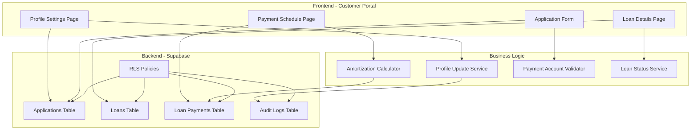

# Design Document: Customer Portal Enhancements

## Overview

This design document outlines the technical implementation for enhancing the customer portal with comprehensive loan management capabilities. The enhancements include profile settings management, payment account collection and display, detailed loan information display, complete amortization schedules, and current loan status tracking.

The system will integrate payment account collection into the existing multi-step application process for all three loan products (Instant, Standard, Premium). Once loans are funded, borrowers will have access to comprehensive loan details including calculated amortization schedules showing the breakdown of each payment.

### Key Design Principles

1. **Security First**: Payment account information must be encrypted at rest and masked in the UI
2. **Immutability**: Payment account information cannot be changed after application submission
3. **Separation of Concerns**: Profile management, payment accounts, and loan details are distinct features with clear boundaries
4. **Progressive Enhancement**: Features are only displayed when relevant (e.g., payment schedules only for funded loans)
5. **Mobile-First**: All UI components must be responsive and work on mobile devices

## Architecture

### System Components



### Data Flow

1. **Application Submission Flow**:
   - User completes application steps including new payment account step
   - Payment account data is validated (routing number format, account number format)
   - Application is submitted with encrypted payment_info in JSONB field
   - Payment account becomes read-only after submission

2. **Loan Funding Flow**:
   - Admin approves application and changes status to 'funded'
   - System sets origination_date to current timestamp
   - Amortization calculator generates complete payment schedule
   - loan_payments table is populated with all payment records
   - Borrower can now view loan details and payment schedule

3. **Profile Update Flow**:
   - Borrower updates profile information
   - System validates changes
   - Changes are saved to database
   - Audit log entry is created with old and new values

## Components and Interfaces

### 1. Profile Settings Component

**Location**: `src/app/(portals)/customer/profile/page.tsx`

**Purpose**: Allow borrowers to view and update their profile information

**Interface**:
```typescript
interface ProfileData {
  fullName: string
  email: string
  phone: string
  businessName: string
  businessAddress: {
    street: string
    city: string
    state: string
    zipCode: string
  }
}

interface PaymentAccountDisplay {
  bankName: string
  accountHolderName: string
  accountType: 'checking' | 'savings'
  accountNumberMasked: string  // "****1234"
  routingNumberMasked: string  // "****5678"
  isEditable: boolean  // Always false after submission
}

function ProfileSettingsPage(): JSX.Element
function updateProfile(userId: string, updates: Partial<ProfileData>): Promise<void>
function getPaymentAccountInfo(applicationId: string): Promise<PaymentAccountDisplay | null>
```

**Key Features**:
- Form with editable fields for name, email, phone, business name, and address
- Read-only display of payment account information with masked numbers
- Validation on all fields before saving
- Success/error messages for user feedback
- Audit logging of all changes

### 2. Payment Account Collection Step

**Location**: `src/lib/application/steps.ts` (new step), `src/components/application/PaymentAccountForm.tsx` (new component)

**Purpose**: Collect payment account information during application process

**Interface**:
```typescript
interface PaymentAccountInfo {
  bankName: string
  accountHolderName: string
  routingNumber: string  // 9 digits
  accountNumber: string  // 4-17 digits
  accountType: 'checking' | 'savings'
  plaidAccountId?: string | null  // For future Plaid integration
  plaidAccessToken?: string | null  // For future Plaid integration
  verificationStatus: 'pending_manual' | 'verified' | 'failed' | 'manual_review'
}

const PAYMENT_ACCOUNT_STEP: ApplicationStep = {
  id: 'payment_account',
  title: 'Payment Account Information',
  description: 'Provide your bank account information for automatic loan payments',
  fields: [
    // Field definitions for bank name, account holder, routing, account number, type
  ],
  isRequired: true,
  nextStepId: 'documents'  // Or 'review' for Instant loans
}

function validateRoutingNumber(routing: string): boolean
function validateAccountNumber(account: string): boolean
function encryptPaymentInfo(info: PaymentAccountInfo): string
```

**Key Features**:
- Input validation for routing number (exactly 9 digits)
- Input validation for account number (4-17 digits)
- Dropdown for account type (checking/savings)
- Clear help text explaining why information is needed
- Warning that information cannot be changed after submission
- Encryption before storing in database

### 3. Loan Details Display Component

**Location**: `src/components/customer/LoanDetails.tsx`

**Purpose**: Display comprehensive loan information for funded loans

**Interface**:
```typescript
interface LoanDetails {
  id: string
  applicationId: string
  principalAmount: number
  interestRate: number  // Stored as decimal (0.25 = 25%)
  termMonths: number
  monthlyPayment: number
  totalAmount: number
  status: 'pending' | 'active' | 'paid_off' | 'defaulted'
  fundingStatus: 'unfunded' | 'partially_funded' | 'fully_funded'
  originationDate: Date
  firstPaymentDueDate: Date
  finalPaymentDueDate: Date
}

function LoanDetailsCard({ loanId }: { loanId: string }): JSX.Element
function getLoanDetails(loanId: string): Promise<LoanDetails>
function formatAPR(rate: number): string  // 0.25 => "25.00%"
function calculateTotalAmount(principal: number, monthlyPayment: number, termMonths: number): number
```

**Key Features**:
- Card-based layout showing all loan information
- Formatted currency display for all amounts
- Formatted percentage display for APR
- Color-coded status badges
- Responsive design for mobile

### 4. Payment Schedule Component

**Location**: `src/components/customer/PaymentSchedule.tsx`

**Purpose**: Display complete amortization schedule with payment details

**Interface**:
```typescript
interface PaymentRecord {
  id: string
  loanId: string
  paymentNumber: number
  dueDate: Date
  amount: number
  principalPortion: number
  interestPortion: number
  remainingBalance: number
  status: 'pending' | 'paid' | 'late' | 'missed'
  paidDate?: Date | null
}

interface PaymentScheduleProps {
  loanId: string
  sortBy?: 'paymentNumber' | 'dueDate'
  filterStatus?: 'all' | 'pending' | 'paid' | 'late' | 'missed'
}

function PaymentScheduleTable({ loanId, sortBy, filterStatus }: PaymentScheduleProps): JSX.Element
function getPaymentSchedule(loanId: string): Promise<PaymentRecord[]>
function sortPayments(payments: PaymentRecord[], sortBy: string): PaymentRecord[]
function filterPayments(payments: PaymentRecord[], status: string): PaymentRecord[]
```

**Key Features**:
- Table display with columns for all payment details
- Sortable by payment number or due date
- Filterable by payment status
- Color-coded status indicators
- Mobile-responsive table (horizontal scroll or stacked cards)
- Pagination for long schedules

### 5. Current Loan Status Component

**Location**: `src/components/customer/CurrentLoanStatus.tsx`

**Purpose**: Display prominent summary of current loan status

**Interface**:
```typescript
interface CurrentLoanStatus {
  nextPaymentDueDate: Date
  nextPaymentAmount: number
  daysUntilDue: number
  totalPaidToDate: number
  remainingBalance: number
  paymentsMade: number
  totalPayments: number
}

function CurrentLoanStatusCard({ loanId }: { loanId: string }): JSX.Element
function getCurrentLoanStatus(loanId: string): Promise<CurrentLoanStatus>
function calculateDaysUntilDue(dueDate: Date): number
function calculateTotalPaid(payments: PaymentRecord[]): number
function getNextPayment(payments: PaymentRecord[]): PaymentRecord | null
```

**Key Features**:
- Large, prominent display of next payment due date and amount
- Countdown to next payment (days remaining)
- Progress indicators showing payments made vs total
- Summary statistics (total paid, remaining balance)
- Visual progress bar

### 6. Amortization Calculator Service

**Location**: `src/lib/loans/amortization.ts`

**Purpose**: Calculate complete amortization schedule using standard formula

**Interface**:
```typescript
interface AmortizationInput {
  principalAmount: number
  annualInterestRate: number  // As decimal (0.25 = 25%)
  termMonths: number
  originationDate: Date
}

interface AmortizationPayment {
  paymentNumber: number
  dueDate: Date
  paymentAmount: number
  principalPortion: number
  interestPortion: number
  remainingBalance: number
}

function calculateAmortizationSchedule(input: AmortizationInput): AmortizationPayment[]
function calculateMonthlyPayment(principal: number, monthlyRate: number, numPayments: number): number
function calculatePaymentBreakdown(
  remainingBalance: number,
  monthlyPayment: number,
  monthlyRate: number
): { principal: number; interest: number }
function addMonthsToDate(date: Date, months: number): Date
```

**Implementation Details**:

The standard amortization formula for monthly payment:
```
M = P * [r(1 + r)^n] / [(1 + r)^n - 1]

Where:
M = Monthly payment
P = Principal (loan amount)
r = Monthly interest rate (APR / 12)
n = Number of payments (term in months)
```

For each payment in the schedule:
1. Calculate interest portion: `remainingBalance * monthlyRate`
2. Calculate principal portion: `monthlyPayment - interestPortion`
3. Calculate new remaining balance: `remainingBalance - principalPortion`
4. Set due date: `originationDate + (paymentNumber * 1 month)`

First payment is due 30 days from origination date.

### 7. Profile Update Service

**Location**: `src/lib/profile/updates.ts`

**Purpose**: Handle profile updates with validation and audit logging

**Interface**:
```typescript
interface ProfileUpdateInput {
  userId: string
  field: 'fullName' | 'email' | 'phone' | 'businessName' | 'businessAddress'
  oldValue: any
  newValue: any
}

interface AuditLogEntry {
  id: string
  userId: string
  actionType: 'profile_update'
  tableName: string
  recordId: string
  oldValues: Record<string, any>
  newValues: Record<string, any>
  createdAt: Date
}

function updateProfileField(input: ProfileUpdateInput): Promise<void>
function createAuditLog(entry: Omit<AuditLogEntry, 'id' | 'createdAt'>): Promise<void>
function validateEmail(email: string): boolean
function validatePhone(phone: string): boolean
function validateZipCode(zip: string): boolean
```

**Key Features**:
- Field-level validation before updates
- Atomic updates (all or nothing)
- Audit logging of all changes
- Error handling with descriptive messages

## Data Models

### Database Schema Changes

#### 1. Applications Table - Add payment_info Field

```sql
-- Add payment_info JSONB column to applications table
ALTER TABLE applications 
ADD COLUMN payment_info JSONB DEFAULT NULL;

-- Add index for querying payment info
CREATE INDEX idx_applications_payment_info ON applications USING GIN (payment_info);

-- Add comment
COMMENT ON COLUMN applications.payment_info IS 'Encrypted payment account information for loan repayment';
```

**payment_info JSONB Structure**:
```json
{
  "bankName": "Bank of America",
  "accountHolderName": "John Smith",
  "routingNumber": "encrypted_value",
  "accountNumber": "encrypted_value",
  "accountType": "checking",
  "plaidAccountId": null,
  "plaidAccessToken": null,
  "verificationStatus": "pending_manual",
  "submittedAt": "2024-01-15T10:30:00Z"
}
```

#### 2. Loans Table - Add Missing Fields

```sql
-- Add interest_rate field (stored as decimal, e.g., 0.25 for 25%)
ALTER TABLE loans 
ADD COLUMN interest_rate DECIMAL(5,4) NOT NULL DEFAULT 0.25;

-- Add term_months field
ALTER TABLE loans 
ADD COLUMN term_months INTEGER NOT NULL DEFAULT 12;

-- Add origination_date field
ALTER TABLE loans 
ADD COLUMN origination_date TIMESTAMP WITH TIME ZONE DEFAULT NULL;

-- Add monthly_payment field
ALTER TABLE loans 
ADD COLUMN monthly_payment DECIMAL(12,2) NOT NULL DEFAULT 0;

-- Add total_amount field (total to be repaid)
ALTER TABLE loans 
ADD COLUMN total_amount DECIMAL(12,2) NOT NULL DEFAULT 0;

-- Add comments
COMMENT ON COLUMN loans.interest_rate IS 'Annual interest rate as decimal (0.25 = 25% APR)';
COMMENT ON COLUMN loans.term_months IS 'Loan term length in months';
COMMENT ON COLUMN loans.origination_date IS 'Date when loan was funded and became active';
COMMENT ON COLUMN loans.monthly_payment IS 'Calculated monthly payment amount';
COMMENT ON COLUMN loans.total_amount IS 'Total amount to be repaid (principal + interest)';
```

#### 3. Create loan_payments Table

```sql
-- Create loan_payments table for amortization schedule
CREATE TABLE loan_payments (
  id UUID PRIMARY KEY DEFAULT gen_random_uuid(),
  loan_id UUID NOT NULL REFERENCES loans(id) ON DELETE CASCADE,
  payment_number INTEGER NOT NULL,
  due_date TIMESTAMP WITH TIME ZONE NOT NULL,
  amount DECIMAL(12,2) NOT NULL,
  principal_portion DECIMAL(12,2) NOT NULL,
  interest_portion DECIMAL(12,2) NOT NULL,
  remaining_balance DECIMAL(12,2) NOT NULL,
  status VARCHAR(20) NOT NULL DEFAULT 'pending',
  paid_date TIMESTAMP WITH TIME ZONE DEFAULT NULL,
  created_at TIMESTAMP WITH TIME ZONE DEFAULT NOW(),
  updated_at TIMESTAMP WITH TIME ZONE DEFAULT NOW(),
  
  CONSTRAINT loan_payments_status_check CHECK (status IN ('pending', 'paid', 'late', 'missed')),
  CONSTRAINT loan_payments_unique_payment UNIQUE (loan_id, payment_number)
);

-- Create indexes
CREATE INDEX idx_loan_payments_loan_id ON loan_payments(loan_id);
CREATE INDEX idx_loan_payments_due_date ON loan_payments(due_date);
CREATE INDEX idx_loan_payments_status ON loan_payments(status);

-- Add updated_at trigger
CREATE TRIGGER update_loan_payments_updated_at 
BEFORE UPDATE ON loan_payments 
FOR EACH ROW 
EXECUTE FUNCTION update_updated_at_column();

-- Add comments
COMMENT ON TABLE loan_payments IS 'Amortization schedule for loans showing payment breakdown';
COMMENT ON COLUMN loan_payments.payment_number IS 'Sequential payment number (1, 2, 3, ...)';
COMMENT ON COLUMN loan_payments.principal_portion IS 'Amount of payment applied to principal';
COMMENT ON COLUMN loan_payments.interest_portion IS 'Amount of payment applied to interest';
COMMENT ON COLUMN loan_payments.remaining_balance IS 'Loan balance remaining after this payment';
```

#### 4. Create audit_logs Table

```sql
-- Create audit_logs table for tracking profile changes
CREATE TABLE audit_logs (
  id UUID PRIMARY KEY DEFAULT gen_random_uuid(),
  user_id UUID NOT NULL REFERENCES auth.users(id) ON DELETE CASCADE,
  action_type VARCHAR(50) NOT NULL,
  table_name VARCHAR(100) NOT NULL,
  record_id UUID NOT NULL,
  old_values JSONB DEFAULT '{}',
  new_values JSONB DEFAULT '{}',
  created_at TIMESTAMP WITH TIME ZONE DEFAULT NOW()
);

-- Create indexes
CREATE INDEX idx_audit_logs_user_id ON audit_logs(user_id);
CREATE INDEX idx_audit_logs_action_type ON audit_logs(action_type);
CREATE INDEX idx_audit_logs_created_at ON audit_logs(created_at);
CREATE INDEX idx_audit_logs_record_id ON audit_logs(record_id);

-- Add comments
COMMENT ON TABLE audit_logs IS 'Audit trail for tracking changes to user data';
COMMENT ON COLUMN audit_logs.action_type IS 'Type of action (e.g., profile_update, payment_update)';
COMMENT ON COLUMN audit_logs.old_values IS 'Previous values before change';
COMMENT ON COLUMN audit_logs.new_values IS 'New values after change';
```

### Row Level Security (RLS) Policies

#### Applications Table - Payment Info Access

```sql
-- Policy: Borrowers can only view their own payment info
CREATE POLICY "Borrowers can view own payment info"
ON applications
FOR SELECT
TO authenticated
USING (
  applicant_id = auth.uid() OR
  auth.jwt() ->> 'role' = 'admin'
);

-- Policy: Borrowers cannot update payment info after submission
CREATE POLICY "Payment info immutable after submission"
ON applications
FOR UPDATE
TO authenticated
USING (
  applicant_id = auth.uid() AND
  (status = 'draft' OR payment_info IS NULL)
)
WITH CHECK (
  applicant_id = auth.uid() AND
  (status = 'draft' OR payment_info IS NULL)
);
```

#### Loan Payments Table - Read Access

```sql
-- Policy: Borrowers can view payments for their own loans
CREATE POLICY "Borrowers can view own loan payments"
ON loan_payments
FOR SELECT
TO authenticated
USING (
  EXISTS (
    SELECT 1 FROM loans l
    JOIN applications a ON l.application_id = a.id
    WHERE l.id = loan_payments.loan_id
    AND a.applicant_id = auth.uid()
  ) OR
  auth.jwt() ->> 'role' = 'admin'
);

-- Policy: Only admins can modify payment records
CREATE POLICY "Only admins can modify payments"
ON loan_payments
FOR ALL
TO authenticated
USING (auth.jwt() ->> 'role' = 'admin')
WITH CHECK (auth.jwt() ->> 'role' = 'admin');
```

#### Audit Logs Table - Read Access

```sql
-- Policy: Users can view their own audit logs
CREATE POLICY "Users can view own audit logs"
ON audit_logs
FOR SELECT
TO authenticated
USING (
  user_id = auth.uid() OR
  auth.jwt() ->> 'role' = 'admin'
);

-- Policy: System can insert audit logs
CREATE POLICY "System can insert audit logs"
ON audit_logs
FOR INSERT
TO authenticated
WITH CHECK (true);
```

### Data Encryption

Payment account information (routing number and account number) must be encrypted before storage:

**Encryption Strategy**:
1. Use Supabase's built-in encryption for JSONB fields
2. Store encrypted values in payment_info JSONB
3. Never log unencrypted account numbers
4. Only decrypt when absolutely necessary (admin verification)
5. Always mask in UI (show last 4 digits only)

**Masking Function**:
```typescript
function maskAccountNumber(accountNumber: string): string {
  if (accountNumber.length <= 4) return '****'
  const lastFour = accountNumber.slice(-4)
  return `****${lastFour}`
}

function maskRoutingNumber(routingNumber: string): string {
  if (routingNumber.length !== 9) return '****'
  const lastFour = routingNumber.slice(-4)
  return `****${lastFour}`
}
```

## Navigation and User Experience

### Customer Portal Navigation Structure

```
Customer Portal
├── Dashboard (Overview)
│   ├── Quick Stats
│   ├── Recent Applications
│   └── Quick Actions
├── Loan Details
│   ├── Loan Information Card
│   ├── Current Status Card
│   └── Payment Schedule Link
├── Payment Schedule
│   ├── Amortization Table
│   ├── Sort/Filter Controls
│   └── Export Options
├── Documents
│   ├── Uploaded Documents List
│   └── Upload New Document
└── Profile
    ├── Personal Information
    ├── Business Information
    └── Payment Account (Read-Only)
```

### Mobile Responsiveness

All components must be mobile-responsive:

1. **Profile Settings**: Stack form fields vertically on mobile
2. **Loan Details**: Use card layout that stacks on mobile
3. **Payment Schedule**: Convert table to card list on mobile or enable horizontal scroll
4. **Current Status**: Maintain prominent display but adjust font sizes
5. **Navigation**: Use hamburger menu on mobile

### Formatting Standards

**Currency Formatting**:
```typescript
function formatCurrency(amount: number): string {
  return new Intl.NumberFormat('en-US', {
    style: 'currency',
    currency: 'USD',
    minimumFractionDigits: 2,
    maximumFractionDigits: 2
  }).format(amount)
}
```

**Date Formatting**:
```typescript
function formatDate(date: Date): string {
  return new Intl.DateTimeFormat('en-US', {
    year: 'numeric',
    month: 'long',
    day: 'numeric'
  }).format(date)
}

function formatShortDate(date: Date): string {
  return new Intl.DateTimeFormat('en-US', {
    year: 'numeric',
    month: 'short',
    day: 'numeric'
  }).format(date)
}
```

**Percentage Formatting**:
```typescript
function formatPercentage(rate: number): string {
  return `${(rate * 100).toFixed(2)}%`
}
```

## Error Handling

### Validation Errors

**Profile Updates**:
- Invalid email format: "Please enter a valid email address"
- Invalid phone format: "Please enter a valid phone number"
- Empty required field: "[Field name] is required"

**Payment Account Collection**:
- Invalid routing number: "Routing number must be exactly 9 digits"
- Invalid account number: "Account number must be between 4 and 17 digits"
- Missing required field: "[Field name] is required"

**Immutability Violations**:
- Attempt to edit payment info after submission: "Payment account information cannot be changed after application submission. Please contact support if you need to update this information."

### Database Errors

**Connection Errors**:
- Display user-friendly message: "Unable to connect to the server. Please check your internet connection and try again."
- Log detailed error for debugging

**RLS Policy Violations**:
- Display: "You don't have permission to access this information."
- Log security event for audit

**Data Integrity Errors**:
- Display: "An error occurred while saving your information. Please try again."
- Log detailed error with context

### Error Logging

All errors should be logged with:
- Timestamp
- User ID (if authenticated)
- Error type and message
- Stack trace (for unexpected errors)
- Context (what operation was being performed)

## Testing Strategy

### Unit Testing

**Profile Update Service**:
- Test validation functions for email, phone, zip code
- Test audit log creation
- Test error handling for invalid inputs
- Test database update operations

**Amortization Calculator**:
- Test monthly payment calculation with known values
- Test payment breakdown calculation
- Test schedule generation for various terms (12, 24, 36, 48, 60 months)
- Test edge cases (0% interest, very large principals)
- Test date calculations (adding months, handling month-end dates)

**Payment Account Validator**:
- Test routing number validation (exactly 9 digits)
- Test account number validation (4-17 digits)
- Test masking functions
- Test encryption/decryption (if implemented)

**Formatting Functions**:
- Test currency formatting with various amounts
- Test date formatting with various dates
- Test percentage formatting with various rates

### Property-Based Testing

Property-based tests will be written for universal properties that should hold across all inputs. These tests will run a minimum of 100 iterations with randomized inputs to verify correctness.

Each property test will be tagged with a comment referencing the design document property:
```typescript
// Feature: customer-portal-enhancements, Property 1: Amortization schedule completeness
```


## Correctness Properties

A property is a characteristic or behavior that should hold true across all valid executions of a system—essentially, a formal statement about what the system should do. Properties serve as the bridge between human-readable specifications and machine-verifiable correctness guarantees.

### Property 1: Profile Field Validation

*For any* profile update (name, email, phone, business name, business address), the validation function should reject empty or invalid inputs and accept valid inputs according to the field's format requirements.

**Validates: Requirements 1.3, 1.4, 1.5, 1.6, 1.7**

### Property 2: Profile Update Audit Logging

*For any* profile field update, the system should create an audit log entry containing the user ID, timestamp, field name, old value, and new value.

**Validates: Requirements 1.8, 8.3**

### Property 3: Payment Account Masking

*For any* account number or routing number, when displayed in the UI or logs, the system should show only the last 4 digits in the format "****1234".

**Validates: Requirements 3.4, 3.5, 8.7**

### Property 4: Routing Number Validation

*For any* string input, the routing number validator should accept only strings that are exactly 9 digits and reject all other inputs.

**Validates: Requirements 2.5**

### Property 5: Account Number Validation

*For any* string input, the account number validator should accept only strings that are between 4 and 17 digits (inclusive) and reject all other inputs.

**Validates: Requirements 2.6**

### Property 6: Payment Account Immutability

*For any* application with status other than 'draft', attempts to modify the payment_info field should be rejected by the system.

**Validates: Requirements 2.9, 2.10**

### Property 7: Payment Account Storage

*For any* payment account information submitted with an application, the system should store the data in the payment_info JSONB field with all required fields present.

**Validates: Requirements 2.8**

### Property 8: APR Formatting

*For any* interest rate stored as a decimal (e.g., 0.25), the formatting function should display it as a percentage with two decimal places (e.g., "25.00%").

**Validates: Requirements 4.2**

### Property 9: First Payment Due Date Calculation

*For any* loan origination date, the first payment due date should be exactly 30 days after the origination date.

**Validates: Requirements 4.9, 5.10**

### Property 10: Subsequent Payment Due Dates

*For any* payment schedule, each payment's due date should be exactly one month after the previous payment's due date.

**Validates: Requirements 5.11**

### Property 11: Amortization Formula Correctness

*For any* loan with principal P, annual interest rate r, and term n months, the monthly payment M calculated using the formula M = P * [r/12 * (1 + r/12)^n] / [(1 + r/12)^n - 1] should result in a payment schedule where the sum of all principal portions equals P and the final remaining balance is 0 (within rounding tolerance).

**Validates: Requirements 5.12**

### Property 12: Payment Record Completeness

*For any* payment record in an amortization schedule, the record should contain all required fields: payment_number, due_date, amount, principal_portion, interest_portion, remaining_balance, and status.

**Validates: Requirements 5.2, 5.3, 5.4, 5.5, 5.6, 5.7, 5.8**

### Property 13: Amortization Schedule Completeness

*For any* funded loan with term n months, the system should generate exactly n payment records in the loan_payments table.

**Validates: Requirements 5.1, 7.10**

### Property 14: Origination Date Setting

*For any* loan that transitions to 'funded' status, the system should set the origination_date field to the current timestamp.

**Validates: Requirements 7.9**

### Property 15: Days Until Due Calculation

*For any* payment due date, the calculated days until due should equal the difference between the due date and the current date.

**Validates: Requirements 6.3**

### Property 16: Total Paid Calculation

*For any* set of payment records, the total paid to date should equal the sum of the amount field for all records with status 'paid'.

**Validates: Requirements 6.8**

### Property 17: Remaining Balance Retrieval

*For any* loan with payment records, the current remaining balance should equal the remaining_balance field of the most recent payment record (highest payment_number).

**Validates: Requirements 6.9**

### Property 18: Payment Schedule Sorting

*For any* payment schedule, sorting by payment_number or due_date should produce a correctly ordered list according to the sort field.

**Validates: Requirements 9.3**

### Property 19: Payment Schedule Filtering

*For any* payment schedule and status filter, filtering should return only payment records matching the specified status.

**Validates: Requirements 9.4**

### Property 20: Currency Formatting

*For any* numeric amount, the currency formatter should produce a string with a dollar sign, comma separators for thousands, and exactly two decimal places.

**Validates: Requirements 9.5**

### Property 21: Date Formatting

*For any* date, the date formatter should produce a human-readable string in the format "Month Day, Year" (e.g., "January 15, 2024").

**Validates: Requirements 9.6**

### Property 22: Plaid Field Initialization

*For any* payment account information stored without Plaid integration, the plaid_account_id and plaid_access_token fields should be null and verification_status should be "pending_manual".

**Validates: Requirements 10.3, 10.4**

### Property 23: Payment Account Encryption

*For any* payment account information stored in the database, the routing_number and account_number fields in the payment_info JSONB should be encrypted (not stored as plaintext).

**Validates: Requirements 8.1**

### Property 24: Profile Display Completeness

*For any* borrower profile, the profile view should display all required fields: full name, email, phone, business name, and business address.

**Validates: Requirements 1.2**

### Property 25: Payment Info Display Immutability

*For any* payment account information displayed in the profile, the UI should render it as read-only (not editable).

**Validates: Requirements 1.9**

## Testing Strategy

### Dual Testing Approach

This feature will use both unit testing and property-based testing to ensure comprehensive coverage:

**Unit Tests** will focus on:
- Specific examples of profile updates (e.g., updating email to "test@example.com")
- Edge cases like empty strings, very long inputs, special characters
- Error conditions (network failures, database errors, validation failures)
- Integration points between components (e.g., profile update triggering audit log)
- UI component rendering with specific data
- Database RLS policy enforcement

**Property-Based Tests** will focus on:
- Universal properties that hold for all inputs (e.g., all account numbers are masked correctly)
- Comprehensive input coverage through randomization
- Mathematical correctness (e.g., amortization calculations)
- Data integrity across operations (e.g., audit logs always created for updates)

### Property-Based Testing Configuration

**Library Selection**: 
- For TypeScript/JavaScript: Use `fast-check` library
- For database tests: Use `pgTAP` or similar PostgreSQL testing framework

**Test Configuration**:
- Each property test must run a minimum of 100 iterations
- Use appropriate generators for each data type (numbers, strings, dates, etc.)
- Include edge case generators (empty strings, boundary values, special characters)

**Test Tagging**:
Each property-based test must include a comment tag referencing the design document property:

```typescript
// Feature: customer-portal-enhancements, Property 1: Profile Field Validation
test('profile field validation rejects invalid inputs', () => {
  fc.assert(
    fc.property(
      fc.record({
        name: fc.string(),
        email: fc.string(),
        phone: fc.string()
      }),
      (profileUpdate) => {
        // Test validation logic
      }
    ),
    { numRuns: 100 }
  )
})
```

### Unit Testing Focus Areas

**Profile Management**:
- Test profile update with valid data succeeds
- Test profile update with invalid email fails with appropriate error
- Test profile update with empty required field fails
- Test audit log is created after successful update
- Test concurrent updates are handled correctly

**Payment Account Collection**:
- Test payment account step appears in all three loan product flows
- Test routing number validation with "123456789" succeeds
- Test routing number validation with "12345678" fails
- Test account number validation with "1234" succeeds
- Test account number validation with "123" fails
- Test payment info is stored in correct JSONB field
- Test payment info cannot be edited after submission

**Amortization Calculator**:
- Test monthly payment calculation with known values (e.g., $10,000 at 25% for 12 months)
- Test schedule generation produces correct number of payments
- Test first payment is 30 days from origination
- Test final payment brings balance to $0
- Test edge case: 0% interest rate
- Test edge case: very large principal ($1,000,000)

**Loan Details Display**:
- Test loan details component renders all required fields
- Test APR is formatted correctly (0.25 → "25.00%")
- Test currency amounts are formatted with $ and commas
- Test dates are formatted in human-readable format
- Test component handles missing data gracefully

**Payment Schedule**:
- Test payment schedule table renders all payment records
- Test sorting by payment number works correctly
- Test sorting by due date works correctly
- Test filtering by status shows only matching records
- Test pagination works for long schedules

**Current Loan Status**:
- Test next payment due date is displayed
- Test days until due is calculated correctly
- Test total paid is sum of paid payments
- Test remaining balance is from most recent payment record
- Test progress bar shows correct percentage

### Integration Testing

**End-to-End Flows**:
1. Complete application with payment account → Submit → Verify payment info stored
2. Admin approves loan → Verify origination date set → Verify payment schedule generated
3. Borrower views loan details → Verify all information displayed correctly
4. Borrower updates profile → Verify audit log created → Verify changes persisted
5. Borrower attempts to edit payment info after submission → Verify error displayed

**Database Integration**:
- Test RLS policies prevent cross-borrower data access
- Test audit logs are created for all profile changes
- Test payment records are created when loan is funded
- Test encryption is applied to payment account data

### Performance Testing

While not part of the core correctness properties, performance should be monitored:

- Profile updates should complete in < 500ms
- Amortization schedule generation should complete in < 1 second for any term length
- Payment schedule display should load in < 1 second for any schedule size
- Loan details page should load in < 2 seconds

### Security Testing

- Verify payment account numbers are never logged in plaintext
- Verify RLS policies prevent unauthorized access
- Verify encryption is applied to sensitive data
- Verify audit logs capture all data changes
- Verify masked display of account numbers in all UI contexts
